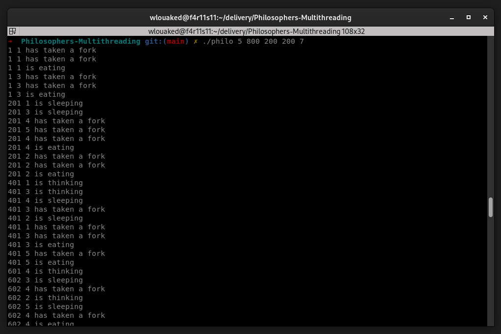

# Key Concepts for the Dining Philosophers Assignment

## General Description
- One or more philosophers sit at a round table.
- In the center of the table, there is a large bowl of spaghetti.
- Philosophers take turns **eating**, **thinking**, and **sleeping**.
  - While **eating**, they are **not thinking** or **sleeping**.
  - While **thinking**, they are **not eating** or **sleeping**.
  - While **sleeping**, they are **not eating** or **thinking**.

<p align="center">
  
</p>

## Forks
- There are as many **forks** as there are **philosophers**.
- A philosopher must pick up **both the fork to their left and the fork to their right** before eating.
- After eating, they put both forks back on the table and start sleeping.

## Rules & Constraints
- The simulation **stops** when a philosopher **dies of starvation**.
- Each philosopher **needs to eat** and must **never starve**.
- **Philosophers do not communicate** with one another.
- **Philosophers are unaware** if another is about to die.
- **Philosophers should avoid dying** at all costs.

## Clone the repository
```bash
git clone git@github.com:louakedwayl/Philosophers-Multithreading.git
```

## Installation
```bash
make
```

## Start the simulation
``` bash
./philo number_of_philosophers time_to_die time_to_eat time_to_sleep [number_of_times_each_philosopher_must_eat]
```
